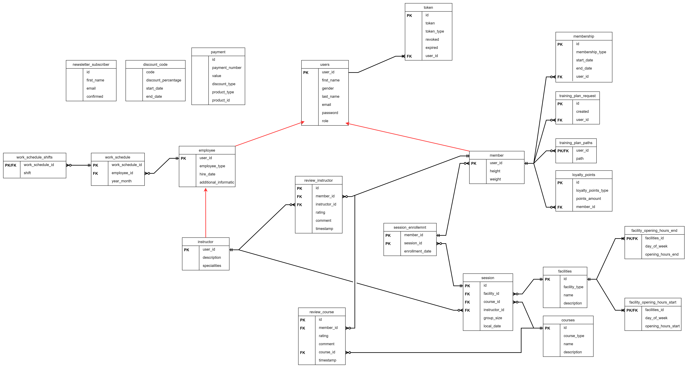
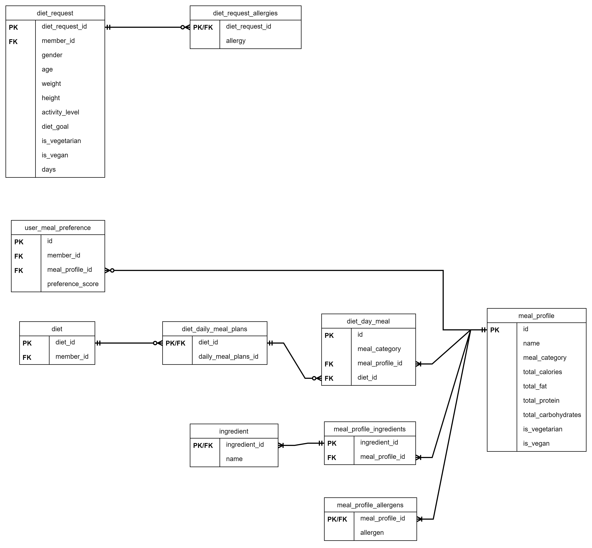

# ZenithActive - Ver.0.0.1 Release(2023.12)

ZenithActive is an advanced fitness management application designed to streamline the management of fitness centers and member services. With a holistic approach to health and fitness management, ZenithActive offers comprehensive solutions for fitness centers, trainers, and users seeking personalized workout and diet plans. Built with scalability in mind, the application supports a wide range of functionalities, from membership management to diet generator algorithm.


## 🛠Tech Stack

- Spring Boot 3.1.6
- Postgres
- Docker
- JUnit 5
- Mockito
- Spring Security with JWT
- OpenWeatherMap (API for weather info)
- Zxing (QR code generation)
- Twilio (SMS notifications)
- Prometheus (monitoring)
- Jenkins (CI/CD)


## Features:

1. **User and Role Management**: Ability to add users with different roles (member, instructor).

2. **Facility Management**: Creation of new Facility objects.

3. **Courses and Sessions**: Creating courses and sessions assigning them to specific facilities and time slots.

4. **Session Enrollment**: Allowing members to enroll in sessions.

5. **Course/Instructor Reviews**: Adding reviews to courses and instructors.

6. **Membership Types**: Options for enrolling in different types of memberships.

7. **Newsletter**: Newsletter functionality for updates and announcements.

8. **Notifications**: Sending emails and SMS for promotions and reminders.

9. **Personalized Training Plans**: Generating PDFs with training plans.

10. **QR Codes**: Generating QR codes for access to specific facilities.

11. **Loyalty Points System**: Managing loyalty points for members.

12. **Diet generator**: Algorithm for generating diet based on request and meal recommendation system.

13. **Work schedule**: Manage employees' schedules

14. **Connect to weather API**: User can check what the weather forecast will be for a given session day

### TODO:

1. Allow exchanging loyalty points for rewards.
2. Possibility for members to add meals.
3. Generating a diet based on the given ingredients.
4. Informing about dangerous weather events and inviting users to indoor sessions.

## Installing and Running

### Prerequisites:
- Java 17
- Docker installed on your machine.

### Steps:
1. Clone the repository:

    ```bash
    git clone https://github.com/Shanzeee/ZenithActive.git
    cd ZenithActive
    ```

2. Build the Docker image:

    ```bash
    docker build -t zenith-active .
    ```

3. Run Docker Compose:

    ```bash
    docker-compose up -d
    ```

   This command will start containers with the ZenithActive application, PostgreSQL, pgAdmin, Jenkins, Prometheus, and Grafana as defined in the docker-compose.yml file.

4. Create PostgreSQL Database:

Make sure to create a PostgreSQL database named "zenith" before running the application. You can use the following SQL commands as a reference:

   ```sql
   CREATE DATABASE zenith;
   ```

Or use pgAdmin available at: http://localhost:5050

### Access the Application:
Once the containers are up and running, you can access the ZenithActive application at http://localhost:8080.

### Access Other Services:

- PostgreSQL: http://localhost:5432
- pgAdmin: http://localhost:5050 (Default credentials: Email: pgadmin4@pgadmin.org, Password: admin)
- Jenkins: http://localhost:8081
- Prometheus: http://localhost:9090
- Grafana: http://localhost:3000 (Default credentials: Username: admin, Password: admin)

### Stop the Containers:
```bash
docker-compose down
```

This command will stop and remove the running containers.

### Notes:
- Ensure that ports 8080, 5432, 5050, 8081, 9090, and 3000 are not in use by other applications on your machine.
- Customize environment variables and configurations in the docker-compose.yml file as needed.
- You can modify the Dockerfile and other configuration files based on your application's requirements.

## Database schema(core):

## Database schema(diet):


## The entire database schema in drawio:
Click [here](data/assets/database_schema.drawio) to download schema in drawio

## API Documentation

Application exposes a robust API with over 60 endpoints to cater to various functionalities. For detailed information on each endpoint, you can explore the API documentation using Swagger UI. After launching the application, visit http://localhost:8080/swagger-ui/index.html#/ to interactively explore and understand the available endpoints, request parameters, and response structures.


## License

ZenithActive is released under the [MIT License](https://choosealicense.com/licenses/mit/).

The MIT License is a permissive open-source license that allows for the free use, modification, and distribution of ZenithActive. Whether you are a fitness center looking to integrate ZenithActive into your operations or a developer interested in contributing to its enhancement, you are welcome to do so within the terms of the MIT License.

I believe in the collaborative spirit of the open-source community, and the MIT License reflects our commitment to fostering a transparent and accessible platform for the benefit of fitness enthusiasts, administrators, and developers alike.

Feel free to explore, modify, and contribute to ZenithActive within the bounds of the MIT License. Let's build a healthier and more connected future together! :)

## Contact

Kacper Barwiński - kbarwinski00@gmail.com

Project Link: https://github.com/Shanzeee/ZenithActive